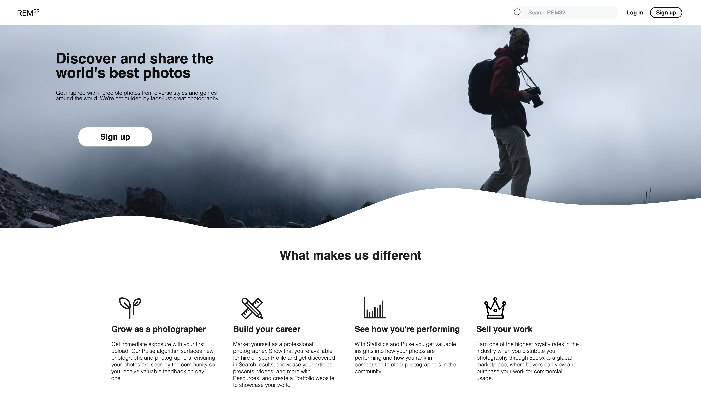
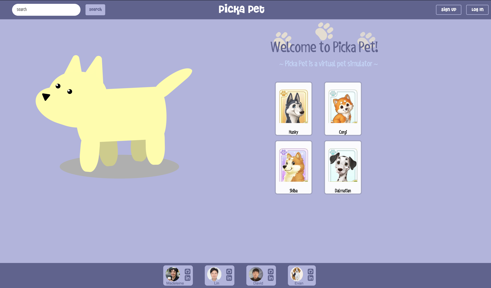
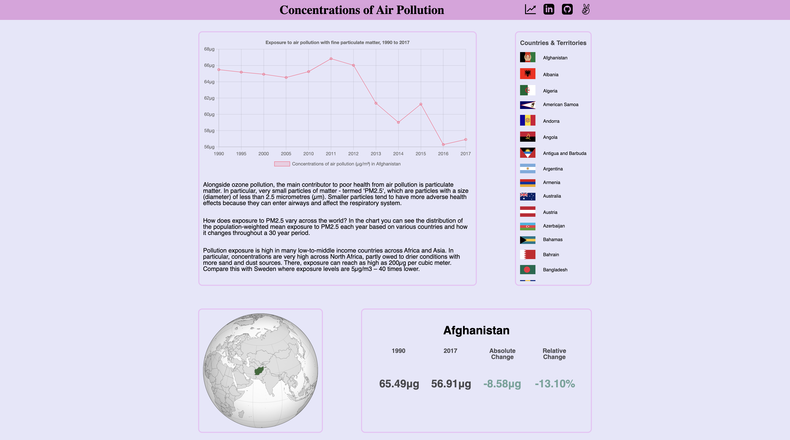

<h2>Hi there, I'm David Zheng!</h2>

 

I am a full-stack software engineer passionate about continuous self-development, collaboration and building web applications.

Check out my portfolio: [Live Link](https://dzhengg98.github.io/personal-portfolio/)

Check out some of my projects:

  
REM32 - 500PX photo-sharing app clone

   
  
   

Technologies Used:

  
Picka Pet - MERN app to adopt virtual pets

   
  
   

Technologies Used:

  
PM25 - Interactive Data Visualization of Air Pollution across the Globe

   
  
   

Technologies Used:

 

## Languages and Tools:

                       

 
 
 

## GitHub Stats:

<h3> Contact Me: </h3>

